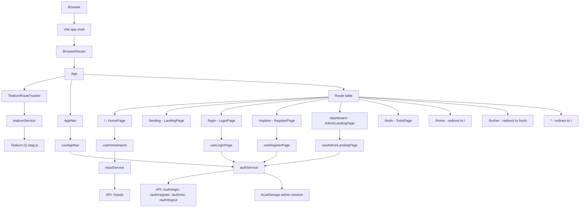
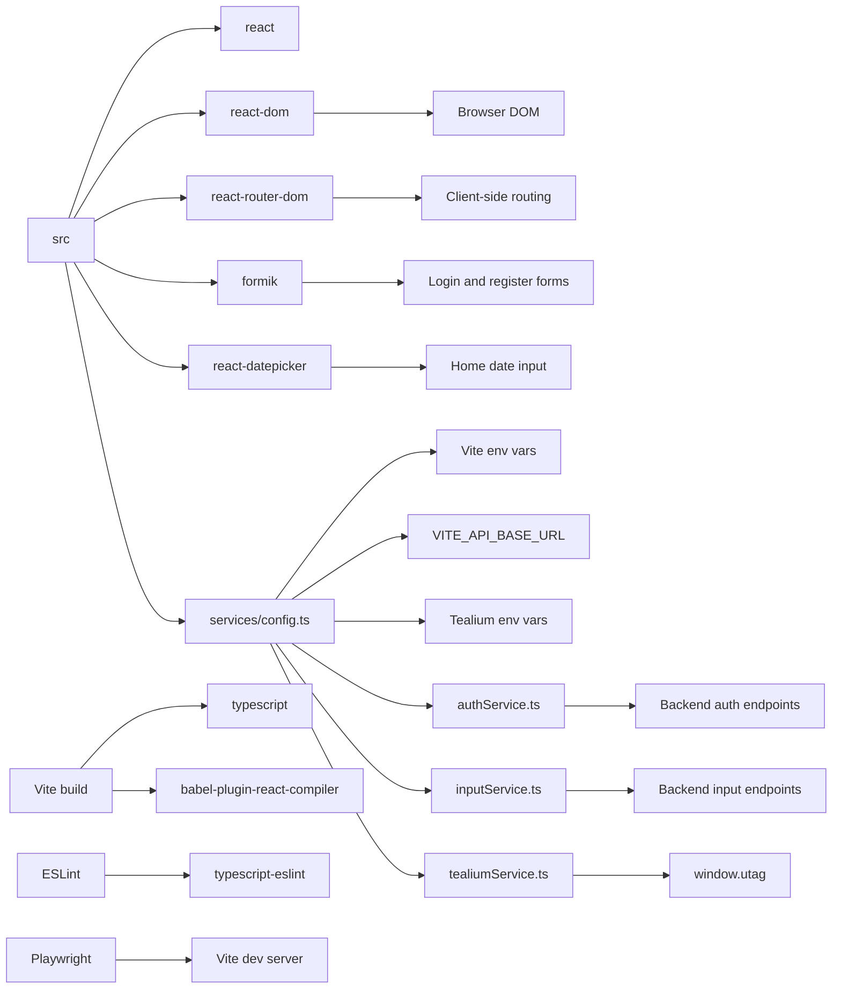
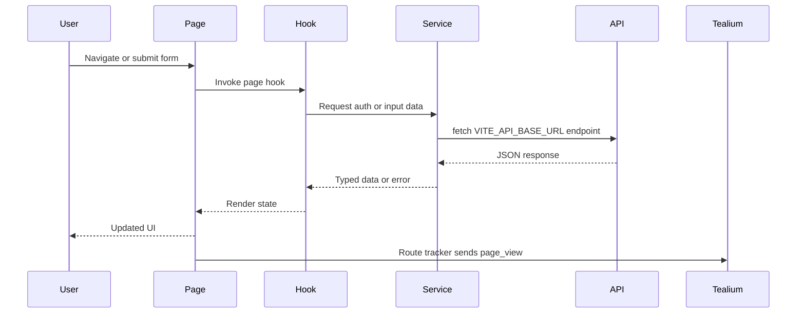

# My Mapper Frontend

My Mapper is a React, TypeScript, and Vite frontend for collecting dated ideas, signing users in, viewing an admin dashboard, opening tool pages, and sending Tealium page-view events on client-side route changes.

## Scripts

```bash
npm run dev
npm run build
npm run lint
npm run test:e2e
npm run preview
```

## Environment

Create a local `.env` from `.env.example` and fill in the values needed by your environment.

```env
VITE_API_BASE_URL=http://127.0.0.1:5000
VITE_ADMIN_USERNAME=admin
VITE_ADMIN_PASSWORD=admin123
VITE_ROUTER_BASE=/

VITE_TEALIUM_ACCOUNT=your-account
VITE_TEALIUM_PROFILE=your-profile
VITE_TEALIUM_ENVIRONMENT=dev
VITE_TEALIUM_ENABLED=true
```

`VITE_ROUTER_BASE` defaults to `/` during local development. Production builds use the Vite base path for GitHub Pages unless this value is overridden.

## Application Flow



## Dependency Flow



## Route Map

| Route | Page | Notes |
| --- | --- | --- |
| `/` | `HomePage` | Main mapper page with saved ideas and date/input submission. |
| `/landing` | `LandingPage` | Placeholder landing page. |
| `/login` | `LoginPage` | Admin username/password and Google auth entry. |
| `/register` | `RegisterPage` | Account registration form. |
| `/dashboard` | `AdminLandingPage` | Session-checked admin landing page. |
| `/tools` | `ToolsPage` | Tools and further components. |
| `/home` | Redirect | Legacy path redirected to `/`. |
| `/further` | Redirect | Legacy path redirected to `/tools`. |
| `*` | Redirect | Unknown paths redirect to `/`. |

Routes are centralized in `src/routes.ts`. Use `appRoutes` instead of hard-coded path strings when adding links, redirects, or navigation calls.

## Tealium

Tag management is wired through Tealium iQ.

When `VITE_TEALIUM_ACCOUNT` and `VITE_TEALIUM_PROFILE` are set, the app loads:

```text
https://tags.tiqcdn.com/utag/{account}/{profile}/{environment}/utag.js
```

`TealiumRouteTracker` initializes Tealium once and sends a `page_view` event on every React Router navigation. Use `trackTealiumEvent` from `src/services/tealiumService.ts` for custom link or interaction tracking.

## Data Flow



## Project Structure

```text
src/
  components/
    AppNav/
    ProgressSideBar/
    TealiumRouteTracker/
  hooks/
  pages/
    AdminLanding/
    Home/
    Landing/
    Login/
    Register/
    Tools/
  services/
    authService.ts
    config.ts
    inputService.ts
    tealiumService.ts
  routes.ts
  App.tsx
  main.tsx
```

## Verification

Use these commands before shipping route, auth, or tracking changes:

```bash
npm run build
npm run lint
npm run test:e2e
```
